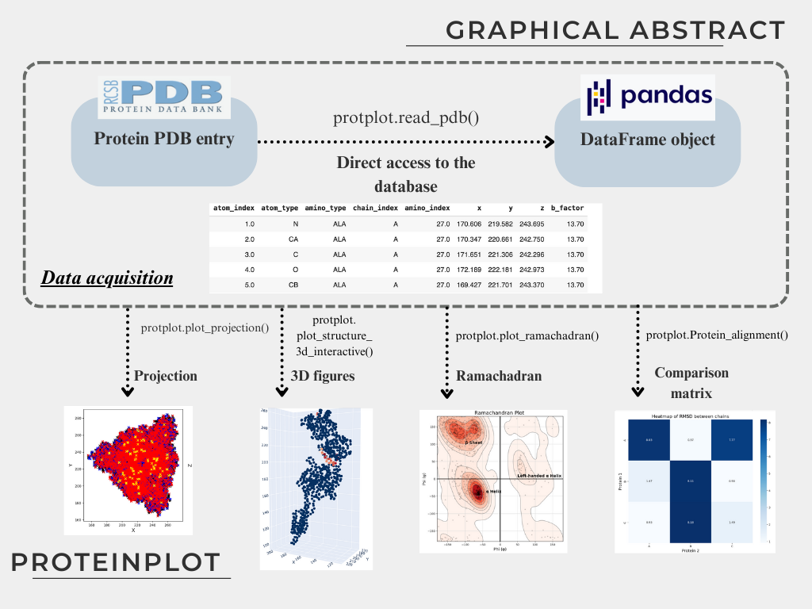

.. _index:

Welcome to ProteinPlot's documentation!
=======================================

Welcome to the documentation for **ProteinPlot**, a university project package for analyzing PDB entries in Python.

ProteinPlot is a lightweight tool for managing `.pdb` files, designed to facilitate easy manipulation and visualization of protein structures. The package provides multiple functions for structural analysis and visualization, and leverages pandas DataFrames for simplified and flexible data handling—even for users new to Python.

Introduction
------------

ProteinPlot aids in the analysis of PDB entries. Files from the RCSB Protein Data Bank (rcsb.org) are loaded into pandas DataFrames, enabling intuitive and efficient data manipulation. The package includes examples of protein structure visualization.

Description
-----------

- **PDB entry reading into pandas DataFrames**

  - Download and load PDB files directly from rcsb.org into pandas for easy processing.

- **Structure alignment and comparison**

  - Basic chain alignment tools for identifying structural similarity between two PDB entries.  
  - Torsion angle calculations between user-defined atoms.

- **Ramachandran plots**

  - Generate informative Ramachandran plots to visualize secondary structure distributions.

- **2D and 3D visualizations**

  - Slice plots for 2D representation of protein structures.  
  - Static and interactive 3D plots using Plotly and Matplotlib.

Installation
------------

You can install ProteinPlot via pip:

.. code-block:: bash

   pip install ProteinPlot

- PyPI page: `PyPI <https://pypi.org/project/ProteinPlot/>`_
- Example usage: `Example Google Colab notebook <https://colab.research.google.com/drive/1C3GE2vf-RWxhAlUEDwfVW5a6ehMTbhd_?usp=sharing>`_

Requirements
------------

Installing ProteinPlot via pip will automatically install the following dependencies:

- numpy
- pandas
- seaborn
- matplotlib
- plotly

For convenience, **jupyter** is also installed to provide a basic local IDE for notebook-based workflows.

Documentation
-------------

.. toctree::
   :maxdepth: 2
   :caption: Contents:

    visualization
    input-output
    structure_comparison
   
