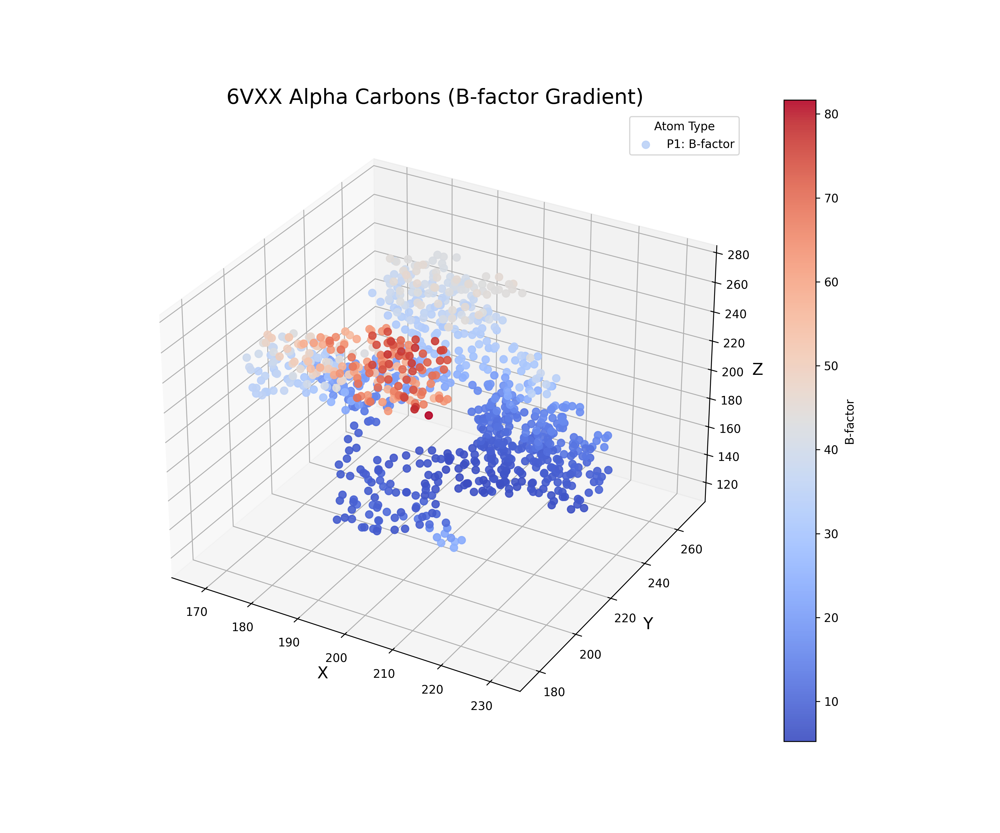
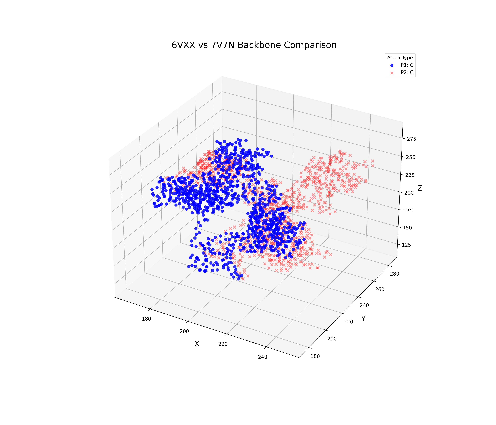

.. ProteinPlot documentation master file, created by
   sphinx-quickstart on Thu May  1 09:55:30 2025.
   You can adapt this file completely to your liking, but it should at least
   contain the root `toctree` directive.

Welcome to ProteinPlot's documentation!
============================================

Welcome to the documentation for **ProteinPlot**, a University package for analysing PDB entries in python

Introduction
------------

ProteinPlot helps in the analysis of PDB entries. The given files from the databank of rcsb.org is loaded into pandas dataframes and in this way manipulations have become easier

Features
--------

- PDB entry reading into pandas df
- Structure alignment
- Structure comparison
- Ramachadran plots
- 2D and 3D figures

Installation
------------

Install via pip:

.. code-block:: bash

   pip install ProteinPlot

Quick Start
-----------

Here's a basic example:

.. code-block:: python

   from ProteinPlot import protplot

   example = protplot.read_pdb('6vxx')

Documentation
-------------

.. toctree::
   :maxdepth: 2
   :caption: Contents:

   usage

plot_structure_3d
-----------------

Static 3D scatter plot using Matplotlib to visualize protein structures from PDB files. You can plot one or two proteins in the same figure, filter by atom or residue type, and color atoms by element, B-factor gradient, or custom mapping.

**Parameters**:

* `protein_df1`, `protein_df2`: DataFrames from `read_pdb()`.
* `atoms1`, `atoms2`: Filter atom types (e.g., `['CA']`) or `'all'`.
* `aminos1`, `aminos2`: Filter residue types (e.g., `['GLY']`) or `'all'`.
* `colorcode`: `'default'`, `'b_factor'`, or a dictionary like `{'C': 'gray'}`.
* `alpha`, `marker`, `marker_size`: Control appearance of points.
* `fig_size`, `Title`, `figsave`: Customize size, title, or save as image.

Examples
^^^^^^^^

.. code-block:: python

   # Example 1: Basic CA atom plot with B-factor gradient coloring and saving the figure to .png
   df = protplot.read_pdb('6vxx', chain='A')
   protplot.plot_structure_3d(
       protein_df1=df,
       atoms1=['CA'],
       colorcode1='b_factor',
       marker1='o',
       marker_size1=40,
       alpha1=0.9,
       Title='6VXX Alpha Carbons (B-factor Gradient)',
       fig_size=(12, 10),
       figsave='6vxx_bfactor_plot.png'
   )

.. code-block:: python

   # Example 2: Overlay two structures with different color maps and atom filters
   df1 = protplot.read_pdb('6vxx', chain='A')
   df2 = protplot.read_pdb('7v7n', chain='A')
   protplot.plot_structure_3d(
       protein_df1=df1,
       protein_df2=df2,
       atoms1=['CA'], atoms2=['CA'],
       colorcode1={'C': 'blue'}, colorcode2={'C': 'red'},
       marker1='o', marker2='x',
       marker_size1=30, marker_size2=30,
       alpha1=0.8, alpha2=0.4,
       Title='6VXX vs 7V7N Backbone Comparison',
       fig_size=(14, 12)
   )

plot_structure_3d_interactive
-----------------------------

Interactive 3D protein visualization using Plotly. Allows for two structures, per-protein customization, and optional coloring by B-factor using a blue-red gradient.

**Parameters**:

* `protein_df1`, `protein_df2`: DataFrames from `read_pdb()`.
* `atoms1`, `atoms2`: Atom types to include or `'all'`.
* `aminos1`, `aminos2`: Residue types to include or `'all'`.
* `colorcode`: `'default'`, `'b_factor'`, or custom dict of colors.
* `alpha`, `marker`, `marker_size`: Visual control of markers.
* `fig_width`, `fig_height`: Control interactive canvas size.
* `Title`, `figsave`: Title of the plot or path to save as `.html`.

Examples
^^^^^^^^

.. code-block:: python

   # Example 1: Interactive plot of one structure colored by B-factor
   df = protplot.read_pdb('6vxx', chain='A')
   protplot.plot_structure_3d_interactive(
       protein_df1=df,
       atoms1=['CA'],
       colorcode1='b_factor',
       marker1='circle',
       marker_size1=5,
       alpha1=0.8,
       fig_width=1000,
       fig_height=800,
       Title='Interactive B-factor View of 6VXX'
   )

.. code-block:: python

   # Example 2: Dual structure interactive plot with custom atom types and colors
   df1 = protplot.read_pdb('6vxx', chain='A')
   df2 = protplot.read_pdb('7v7n', chain='A')
   protplot.plot_structure_3d_interactive(
       protein_df1=df1,
       protein_df2=df2,
       atoms1=['CA'], atoms2=['CA'],
       colorcode1={'C': 'green'}, colorcode2={'C': 'orange'},
       marker1='circle', marker2='x',
       marker_size1=6, marker_size2=6,
       alpha1=0.7, alpha2=0.4,
       fig_width=1200,
       fig_height=1000,
       Title='Interactive Comparison: 6VXX vs 7V7N'
   )

