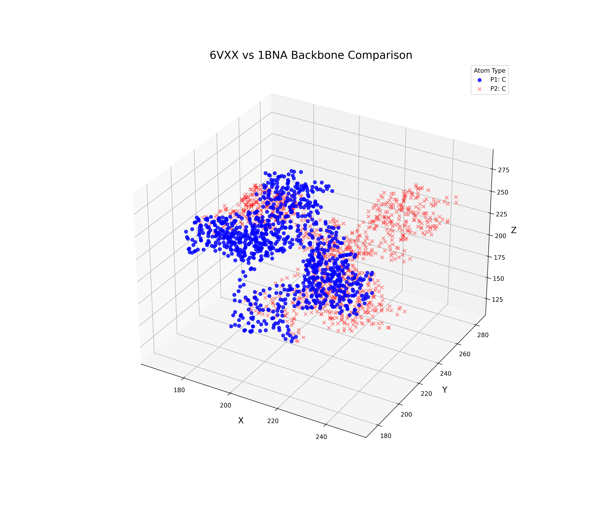

plot_projection
===============

.. function:: plot_projection(protein_df, colorcode='default', atoms='all', aminos='all', alpha=1, marker='x', Title=None, figsave=None)

   Creates 2D scatter plots of a protein's structure projected along different axis planes (XY, XZ, and ZY).

   **Parameters:**

   * **protein_df** (*pandas.DataFrame*):  
     A DataFrame representing the protein structure, as returned by :func:`read_pdb`.

   * **colorcode** (*dict* or `'default'`, optional):  
     Dictionary mapping atom types to colors. Use `'default'` for predefined colors:
     ``{'C': 'black', 'N': 'blue', 'O': 'red', 'S': 'yellow'}``.

  * **atoms** (*str* or *list*, optional):  
     Specify atom types to include (e.g., `['CA']`). Use `'all'` to include all atom types.

   * **aminos** (*str* or *list*, optional):  
     Specify amino acids to include (e.g., `['CYS']`). Use `'all'` to include all.

   * **alpha** (*float*, optional):  
     Transparency level of the markers (0.0 to 1.0). Default is 1 (fully opaque).

   * **marker** (*str*, optional):  
     Marker style for the scatter plot (e.g., `'x'`, `'o'`, `'^'`).

   * **Title** (*str*, optional):  
     Optional title for the plot.

   * **figsave** (*str*, optional):  
     If provided, saves the figure to the given file path (e.g., `'projection.png'`).

   **Returns:**

   * Displays a Matplotlib figure with three subplots showing XY, XZ, and ZY projections.
   * Optionally saves the figure if `figsave` is specified.

plot_structure_3d
-----------------

Static 3D scatter plot using Matplotlib to visualize protein structures from PDB files. You can plot one or two proteins in the same figure, filter by atom or residue type, and color atoms by element, B-factor gradient, or custom mapping.

**Parameters**:

* `protein_df1`, `protein_df2`: DataFrames from `read_pdb()`.
* `atoms1`, `atoms2`: Filter atom types (e.g., `['CA']`) or `'all'`.
* `aminos1`, `aminos2`: Filter residue types (e.g., `['GLY']`) or `'all'`.
* `colorcode`: `'default'`, `'b_factor'`, or a dictionary like `{'C': 'gray'}`.
* `alpha`, `marker`, `marker_size`: Control appearance of points.
* `fig_size`, `Title`, `figsave`: Customize size, title, or save as image.

Examples
^^^^^^^^

.. code-block:: python

   # Example 1: Basic CA atom plot with B-factor gradient coloring and saving the figure to .png
   df = protplot.read_pdb('6vxx', chain='A')
   protplot.plot_structure_3d(
       protein_df1=df,
       atoms1=['CA'],
       colorcode1='b_factor',
       marker1='o',
       marker_size1=40,
       alpha1=0.9,
       Title='6VXX Alpha Carbons (B-factor Gradient)',
       fig_size=(12, 10),
       figsave='6vxx_bfactor_plot.png'
   )

.. code-block:: python

   # Example 2: Overlay two structures with different color maps and atom filters
   df1 = protplot.read_pdb('6vxx', chain='A')
   df2 = protplot.read_pdb('7v7n', chain='A')
   protplot.plot_structure_3d(
       protein_df1=df1,
       protein_df2=df2,
       atoms1=['CA'], atoms2=['CA'],
       colorcode1={'C': 'blue'}, colorcode2={'C': 'red'},
       marker1='o', marker2='x',
       marker_size1=30, marker_size2=30,
       alpha1=0.8, alpha2=0.4,
       Title='6VXX vs 7V7N Backbone Comparison',
       fig_size=(14, 12)
   )

plot_structure_3d_interactive
-----------------------------

Interactive 3D protein visualization using Plotly. Allows for two structures, per-protein customization, and optional coloring by B-factor using a blue-red gradient.

**Parameters**:

* `protein_df1`, `protein_df2`: DataFrames from `read_pdb()`.
* `atoms1`, `atoms2`: Atom types to include or `'all'`.
* `aminos1`, `aminos2`: Residue types to include or `'all'`.
* `colorcode`: `'default'`, `'b_factor'`, or custom dict of colors.
* `alpha`, `marker`, `marker_size`: Visual control of markers.
* `fig_width`, `fig_height`: Control interactive canvas size.
* `Title`, `figsave`: Title of the plot or path to save as `.html`.

Examples
^^^^^^^^

.. code-block:: python

   # Example 1: Interactive plot of one structure colored by B-factor
   df = protplot.read_pdb('6vxx', chain='A')
   protplot.plot_structure_3d_interactive(
       protein_df1=df,
       atoms1=['CA'],
       colorcode1='b_factor',
       marker1='circle',
       marker_size1=5,
       alpha1=0.8,
       fig_width=1000,
       fig_height=800,
       Title='Interactive B-factor View of 6VXX'
   )

.. code-block:: python

   # Example 2: Dual structure interactive plot with custom atom types and colors
   df1 = protplot.read_pdb('6vxx', chain='A')
   df2 = protplot.read_pdb('7v7n', chain='A')
   protplot.plot_structure_3d_interactive(
       protein_df1=df1,
       protein_df2=df2,
       atoms1=['CA'], atoms2=['CA'],
       colorcode1={'C': 'green'}, colorcode2={'C': 'orange'},
       marker1='circle', marker2='x',
       marker_size1=6, marker_size2=6,
       alpha1=0.7, alpha2=0.4,
       fig_width=1200,
       fig_height=1000,
       Title='Interactive Comparison: 6VXX vs 7V7N'
   )
